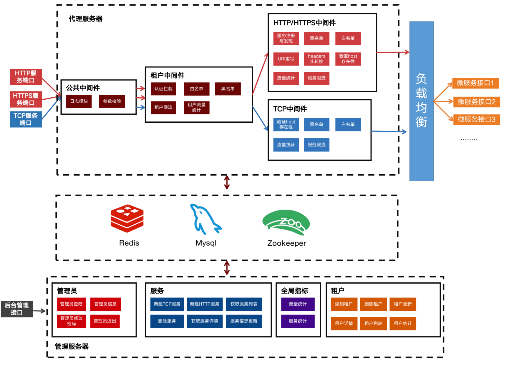
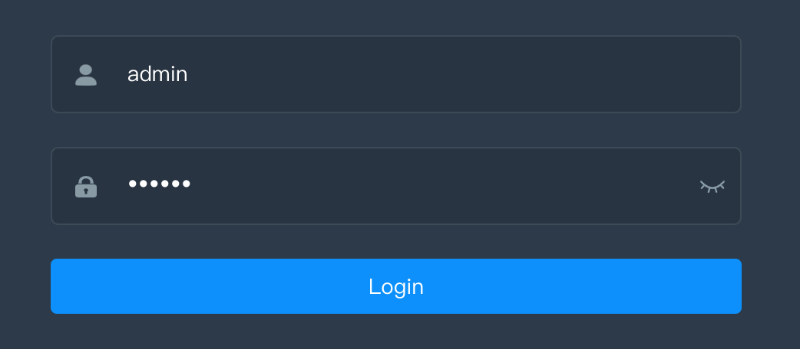
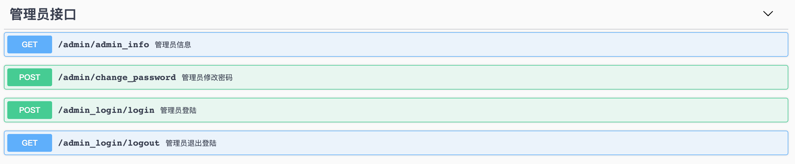
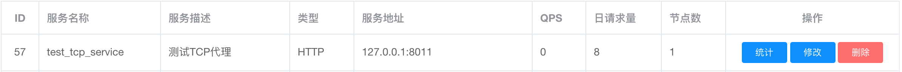
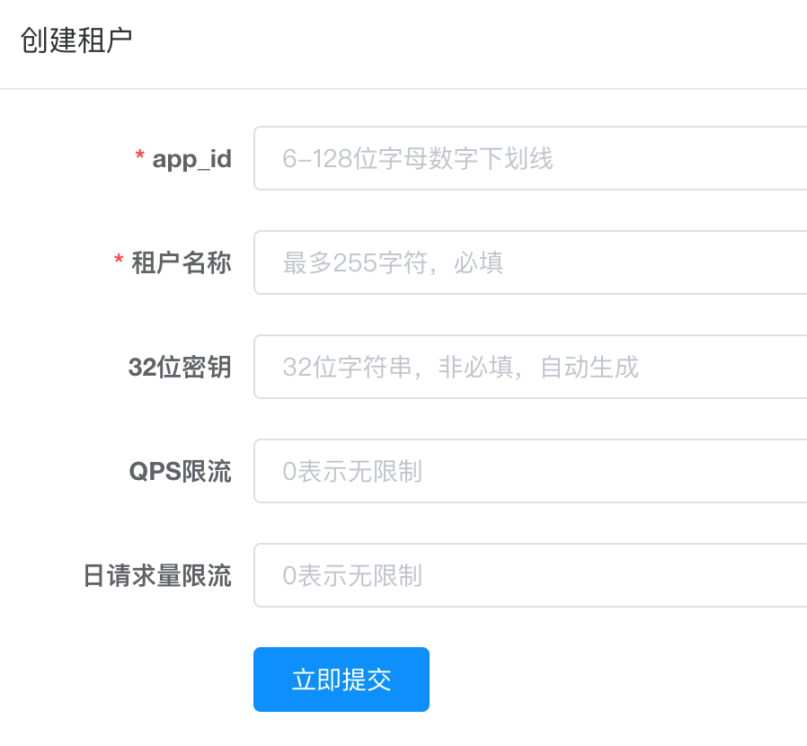
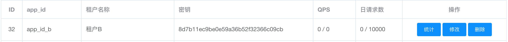

# 项目介绍
本项目是利用Golang实现的网关项目，应用技术栈为gin、redis、mysql、zookeeper

下图是网关的整体架构图，架构由代理服务器和管理服务器组成，其中两台服务都在同一个项目代码中呈现

# 功能介绍

## 管理后台部分
1. 管理员基于Redis的后台session登陆，可以实现有状态的访问网关管理后台

2. 支持管理员信息获取与密码修改

3. 支持管理员创建HTTP/HTTPS代理转发服务
   
4. 支持管理员创建TCP代理转发服务

5. 使用swagger生成了api接口方便给前端调用
   
6. 支持在管理员后台查看所有的服务的QPS、日访问量、转发节点的数量等信息，以及对流量进行统计

7. 支持在管理员后台添加租户信息并查看当前租户的QPS、日请求数等信息

8. 统计所有的服务数、服务占比、当天的网关访问量、当前QPS等全局信息

## 代理转发服务器部分

1. 支持根据不同的负载均衡策略对HTTP/HTTPS服务进行代理转发

2. 支持根据不同的负载均衡策略对TCP服务进行代理转发
   
3. 根据租户的用户名和密钥使用JWT实现Token认证

**中间件：**

HTTP/HTTPS服务：

1. 对所有HTTP/HTTPS服务流量进行统计 
2. 对所有HTTP/HTTPS服务流量进行限流熔断 
3. 对所有HTTP/HTTPS服务根据客户端ip进行白名单/黑名单控制 
4. 对所有HTTP/HTTPS服务根据客户端ip根据配置进行uri重写
5. 对所有HTTP/HTTPS服务根据客户端ip根据配置进行headers头转换
6. 对所有HTTP/HTTPS服务根据租户信息进行权限认证拦截
7. 对所有HTTP/HTTPS服务根据租户信息进行租户流量统计
8. 对所有HTTP/HTTPS服务根据租户信息进行租户限流熔断

TCP服务：
1. 对所有TCP服务流量进行统计 
2. 对所有TCP服务流量进行限流熔断 
3. 对所有TCP服务根据客户端ip进行白名单/黑名单控制 

# 部分功能实现过程(个人博客链接)

[JWT验证的原理，以及在项目中实现JWT的验证登陆](https://blog.csdn.net/weixin_43823723/article/details/107507276)

[实现服务注册与发现(Zookeeper介绍、安装以及使用)](https://blog.csdn.net/weixin_43823723/article/details/107404199)

[HTTPS、HTTP1.1与HTTP2的区别、概念和联系(使用golang实现HTTP2服务器)](https://blog.csdn.net/weixin_43823723/article/details/107379830)

[谈一谈go中的限流方法以及time/rate限速器](https://blog.csdn.net/weixin_43823723/article/details/107362845)

[在mac下配置golang环境下的swagger，实现api文档的自动生成](https://blog.csdn.net/weixin_43823723/article/details/107303290)

[go实现反向代理的四种负载轮询方法（随机、顺序、加权、哈希一致性)](https://blog.csdn.net/weixin_43823723/article/details/107274379)

[go实现反向代理服务器](https://blog.csdn.net/weixin_43823723/article/details/107274313)

